<div align="right">
  
</div>

# AWS 技术支持工程师学习路径

**作者**: RJ.Wang  
**邮箱**: renjun.wang@vstecs.com  
**创建时间**: 2026-01-19  
**最后更新**: 2026-01-20  
**版本**: v1.3

---

## 📖 前言：知行合一的学习之道

> "临渊羡鱼，不如退而结网。" —— 《汉书·董仲舒传》

在学习的道路上，我们见过太多人陷入"知识焦虑"的陷阱：收藏了无数教程却从未打开，购买了大量课程却浅尝辄止，羡慕他人的技术能力却迟迟不肯动手。这就像站在河边羡慕别人捕鱼，却不愿意回去编织自己的渔网。

### 💡 三个核心学习理念

#### 1️⃣ 临渊羡鱼，不如退而结网 —— 实践是唯一的捷径

**理念阐述**：与其羡慕他人的技术能力，不如立即动手实践。这是我在多年技术学习中最深刻的体会：看再多的视频教程、读再多的技术文档，都不如亲自动手操作一次来得深刻。云计算技术看似高深莫测，但每一位技术专家都是从零开始，通过一次次实践编织出自己的"技能之网"。

**科学依据**：
- **学习金字塔理论**表明，被动学习（听讲、阅读）的知识留存率只有 5-10%，而主动实践的留存率高达 75%
- **肌肉记忆**：动手操作会形成肌肉记忆，让技能成为本能
- **错误驱动学习**：只有自己动手，才会遇到真实的问题，而解决问题的过程才是最宝贵的学习机会

**实践建议**：
- 看完教程后，立即关闭视频，尝试自己复现
- 不要复制粘贴命令，手动输入每一行代码
- 故意制造一些"错误"，观察系统的反应
- 从简单的 EC2 实例开始，每天进步一点点
- 记录每次实践的过程和遇到的问题

#### 2️⃣ 以终为始 —— 用项目驱动学习

**理念阐述**：很多人学习技术时，习惯先把所有课程看完、所有文档读完，然后才开始动手。结果往往是：学了很多，却不知道能做什么；看似懂了，一动手就懵了。这就像学游泳，你不可能在岸上把所有理论学完再下水，而是要带着"学会游泳"这个明确目标，边学边练。技术学习也是如此——**先确定你要做什么项目，再去学习需要的技术**。正如《孙子兵法》所言："夫未战而庙算胜者，得算多也。" 打仗之前要先谋划好策略，学习之前也要先明确目标。这种"以终为始"的项目驱动学习方式，远比漫无目的地"刷课程"更高效。

**为什么项目驱动更有效**：
- **目标明确**：知道为什么学，学习更有动力
- **知识关联**：在实际场景中学习，知识点自然串联
- **成就感强**：看到项目成果，获得即时反馈
- **记忆深刻**：解决实际问题的经验，终身难忘
- **学以致用**：避免学了一堆"屠龙之技"却无用武之地

**实践建议**：
- 不要从头到尾学完所有理论再动手，而是边学边做
- 设定一个小目标：比如"搭建一个个人博客"、"部署一个 Web 应用"
- 遇到不懂的知识点，再去针对性学习
- 每完成一个项目，就提升一个难度级别
- 建立自己的项目作品集，记录成长轨迹

**示例**：
- ❌ 错误方式：先学完所有 AWS 服务，再考虑做什么
- ✅ 正确方式：想做一个网站 → 学习 EC2 → 需要数据库 → 学习 RDS → 需要 CDN → 学习 CloudFront

#### 3️⃣ 最好的学习是"教" —— 输出倒逼输入

**理念阐述**：费曼学习法告诉我们，如果你能把一个概念用简单的语言教给别人，那你才是真正理解了它。"教"是最高效的学习方式，因为它要求你：
- 系统化地组织知识
- 深入理解每个细节
- 用清晰的逻辑表达
- 预判和回答可能的疑问

**实践建议**：
- 写技术博客，记录学习过程
- 在团队内部做技术分享
- 回答社区中的技术问题
- 制作学习笔记，假设要教给新人
- 参与开源项目，贡献文档和代码

### 🎯 知行合一：王阳明的智慧在技术学习中的应用

明代哲学家王阳明提出的"知行合一"思想，对技术学习有着深刻的指导意义：

**"知之真切笃实处即是行，行之明觉精察处即是知。"**

这句话的核心是：**真正的知识必须通过实践来验证，而有效的实践必须基于深刻的理解。**

#### 在 AWS 学习中的体现

**❌ 错误的学习方式（知行分离）**：
- 看完 100 小时视频课程，却从未登录过 AWS 控制台
- 背诵了所有服务的特性，却不知道如何部署一个简单的应用
- 收藏了大量技术文章，却从未动手实践过其中任何一个
- 考取了认证证书，却无法解决实际工作中的问题

**✅ 正确的学习方式（知行合一）**：
- 学习 EC2 的同时，立即启动一个实例并配置
- 理解 VPC 概念后，马上设计并搭建一个网络架构
- 阅读安全最佳实践时，同步检查和优化自己的配置
- 每学习一个新服务，就用它解决一个实际问题

### 🚀 本文档的使用建议

基于以上学习理念，我建议你这样使用本学习路径：

1. **不要只是阅读**：看到每个知识点，立即思考如何实践
2. **边学边做**：每完成一个章节的学习，就完成对应的实战项目
3. **记录分享**：建立自己的学习笔记，定期分享给他人
4. **主动出击**：不要等到"完全准备好"才开始，现在就动手
5. **拥抱错误**：遇到问题是好事，解决问题才是真正的学习

### 💪 给你的鼓励

技术学习没有捷径，但有正确的方法。当你感到迷茫时，记住：

- **每个专家都曾是新手**：AWS 的架构师们也是从第一个 EC2 实例开始的
- **实践出真知**：你动手操作一次，胜过看别人演示十次
- **教学相长**：当你能教会别人时，你就真正掌握了
- **知行合一**：理论和实践必须结合，才能形成真正的能力

现在，让我们开始这段知行合一的学习之旅吧！

---

## 📋 目录

- [学习路径概览](#-学习路径概览)
- [阶段一：基础技能](#-阶段一基础技能)
- [阶段二：AWS 核心服务与部署](#️-阶段二aws-核心服务与部署)
- [阶段三：专业领域进阶](#-阶段三专业领域进阶)
- [阶段四：高级实践](#-阶段四高级实践)
- [实战项目](#-实战项目)
- [学习资源](#-学习资源)

---

## 🎯 学习路径概览

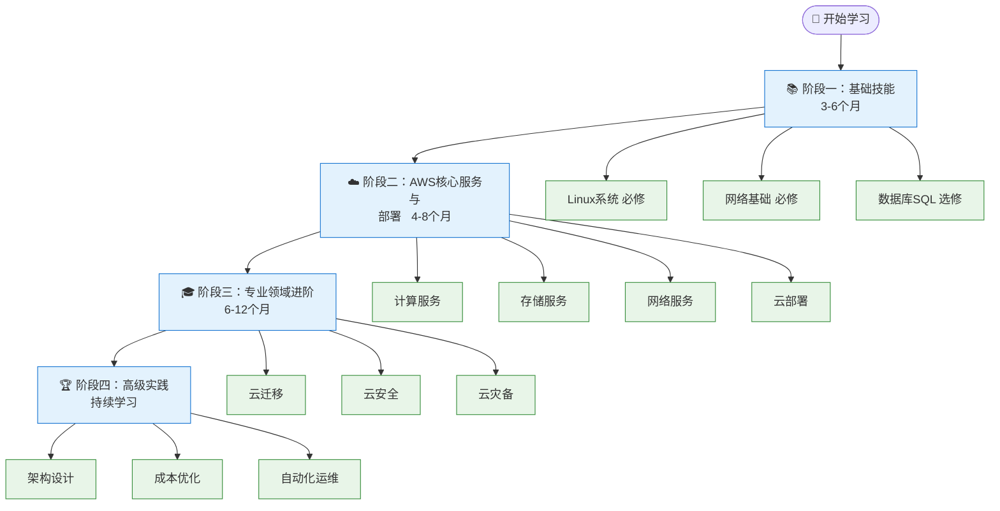

---

## 📚 阶段一：基础技能

### 1️⃣ Linux 系统管理（必修）

#### 🎯 学习目标
- 熟练使用 Linux 命令行
- 理解文件系统和权限管理
- 掌握系统监控和故障排查

#### 📖 核心知识点

**基础操作**
- 文件和目录管理：`ls`, `cd`, `mkdir`, `rm`, `cp`, `mv`
- 文本处理：`cat`, `grep`, `sed`, `awk`, `vim`
- 进程管理：`ps`, `top`, `htop`, `kill`, `systemctl`
- 用户和权限：`chmod`, `chown`, `useradd`, `sudo`

**系统管理**
- 包管理：`yum`/`dnf` (RHEL/Amazon Linux), `apt` (Ubuntu)
- 服务管理：`systemctl`, `service`
- 日志分析：`journalctl`, `/var/log/`
- 磁盘管理：`df`, `du`, `fdisk`, `lsblk`

**网络工具**
- 连接测试：`ping`, `telnet`, `nc`, `curl`, `wget`
- 网络配置：`ip`, `ifconfig`, `netstat`, `ss`
- DNS 工具：`dig`, `nslookup`, `host`
- 防火墙：`iptables`, `firewalld`

**Shell 脚本**
- Bash 脚本基础
- 变量和条件判断
- 循环和函数
- 自动化任务

#### 🔧 实践项目
1. 搭建 LAMP/LEMP 环境
2. 编写系统监控脚本
3. 配置定时任务（cron）
4. 实现日志轮转和清理

#### 📚 推荐资源

**Linux 基础**
- 📖 [《鸟哥的 Linux 私房菜》- 简体中文版](http://cn.linux.vbird.org/) - 在线免费阅读
- 📖 [《Linux 就该这么学》](https://www.linuxprobe.com/) - 国内优秀教程
- 🎓 [Linux 命令大全](https://www.linuxcool.com/) - 命令查询手册
- 📺 [韩顺平 Linux 教程 - B站](https://www.bilibili.com/video/BV1Sv411r7vd/) - 零基础入门

**Vim 编辑器（重点推荐）**
- 🌟 [《简明 Vim 练级攻略》- 左耳朵耗子（陈皓）](https://coolshell.cn/articles/5426.html) - **强烈推荐！** 中文世界最好的 Vim 入门教程之一。陈皓老师（网名"左耳朵耗子"）的 CoolShell 博客影响了无数中国程序员，他对技术的热爱和分享精神永远值得我们学习和铭记。感谢他为中国技术社区所做的一切，愿天堂没有 Bug！
- 📝 [Vim 快捷键速查表](https://vim.rtorr.com/lang/zh_cn/) - 常用命令速查

---

### 2️⃣ 网络基础（必修）

#### 🎯 学习目标
- 理解 OSI 七层模型和 TCP/IP 协议栈
- 掌握网络故障排查方法
- 熟悉云网络架构设计

#### 📖 核心知识点

**网络协议**
- TCP/IP 协议族
- HTTP/HTTPS 协议
- DNS 解析流程
- DHCP 工作原理

**网络层次**
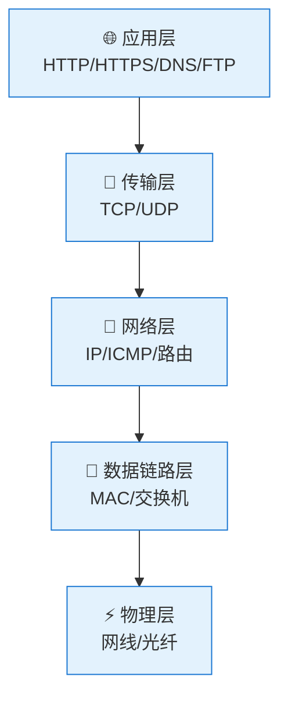

**IP 地址和子网**
- IPv4 地址分类
- CIDR 表示法
- 子网划分计算
- 公网 IP vs 私网 IP

**路由和交换**
- 路由表概念
- 静态路由 vs 动态路由
- NAT 地址转换
- 负载均衡原理

**安全基础**
- 防火墙规则
- 安全组概念
- VPN 隧道
- SSL/TLS 证书

#### 🔧 实践项目
1. 搭建 VPC 网络环境
2. 配置子网和路由表
3. 实现 NAT 网关
4. 配置 VPN 连接

#### 📚 推荐资源
- 🌟 [《图解网络》- 小林 coding](https://xiaolincoding.com/network/) - **强烈推荐！** 用图解的方式讲解计算机网络，通俗易懂，配有大量精美图示，非常适合初学者快速掌握网络基础知识。涵盖 TCP/IP、HTTP、HTTPS 等核心协议
- 🌟 [《TCP/IP 的那些事儿》- 左耳朵耗子（陈皓）](https://coolshell.cn/articles/11564.html) - 深入浅出讲解 TCP/IP 协议，陈皓老师的经典网络技术文章
- 🎓 [计算机网络微课堂 - B站](https://www.bilibili.com/video/BV1c4411d7jb/) - 配套视频教程
- 🔗 [IP 地址计算器](https://tool.chinaz.com/tools/subnetmask) - 站长工具
- 📚 [AWS VPC 用户指南（中文）](https://docs.aws.amazon.com/zh_cn/vpc/latest/userguide/) - AWS 官方文档

---

### 3️⃣ 数据库 SQL（选修）

#### 🎯 学习目标
- 掌握 SQL 查询语言
- 理解关系型数据库原理
- 熟悉数据库性能优化

> **💡 说明**：如果你的工作重点不涉及数据库管理，可以先跳过此部分，在需要时再回来学习。但建议至少掌握基本的 SQL 查询语法，因为在 AWS 中会经常用到 RDS、Aurora 等数据库服务。

#### 📖 核心知识点

**SQL 基础**
- DDL：`CREATE`, `ALTER`, `DROP`
- DML：`SELECT`, `INSERT`, `UPDATE`, `DELETE`
- DCL：`GRANT`, `REVOKE`
- TCL：`COMMIT`, `ROLLBACK`

**查询技巧**
- JOIN 连接查询
- 子查询和嵌套查询
- 聚合函数：`COUNT`, `SUM`, `AVG`, `MAX`, `MIN`
- 分组和排序：`GROUP BY`, `ORDER BY`
- 索引优化

**数据库管理**
- 用户和权限管理
- 备份和恢复
- 事务和锁机制
- 性能监控和调优

**NoSQL 基础**
- 键值存储：Redis（缓存、会话管理）
- 文档数据库：MongoDB（灵活的数据模型）

> **💡 说明**：NoSQL 数据库在现代应用中越来越重要，Redis 和 MongoDB 是最常用的两种。Redis 主要用于缓存和会话管理，MongoDB 适合存储非结构化数据。

#### 🔧 实践项目
1. 设计电商数据库模型
2. 编写复杂查询语句
3. 实现数据库备份策略
4. 性能调优实战

#### 📚 推荐资源
- 🎓 [SQL 教程 - W3School](https://www.w3school.com.cn/sql/index.asp) - 中文教程
- 📚 [PostgreSQL 中文文档](http://www.postgres.cn/docs/14/) - 官方中文翻译
- 📺 [MySQL 数据库教程 - B站](https://www.bilibili.com/video/BV1iq4y1u7vj/) - 零基础入门
- 📚 [MySQL 官方文档](https://dev.mysql.com/doc/) - 英文原版参考

---

## ☁️ 阶段二：AWS 核心服务与部署

### 1️⃣ 计算服务

#### EC2 (Elastic Compute Cloud)
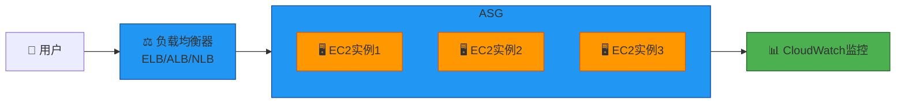

**核心知识**
- 实例类型选择（通用型、计算优化、内存优化）
- AMI 镜像管理
- 安全组和网络配置
- 存储选项（EBS、实例存储）
- Auto Scaling 策略
- 负载均衡器类型（ALB、NLB、CLB）

**实践任务**
- 启动和配置 EC2 实例
- 创建自定义 AMI
- 配置 Auto Scaling 组
- 实现高可用架构

#### Lambda (无服务器计算)
- 函数编写和部署
- 触发器配置
- 环境变量和层
- 性能优化和成本控制

#### ECS/EKS (容器服务)
- Docker 容器基础
- ECS 任务定义
- Fargate vs EC2 启动类型
- EKS 集群管理

#### 📚 推荐资源
- 📚 [AWS EC2 用户指南（中文）](https://docs.aws.amazon.com/zh_cn/ec2/) - EC2 官方完整文档
- 📖 [AWS Lambda 开发者指南（中文）](https://docs.aws.amazon.com/zh_cn/lambda/latest/dg/) - 无服务器计算
- 📖 [Amazon ECS 开发者指南（中文）](https://docs.aws.amazon.com/zh_cn/ecs/) - 容器服务
---

### 2️⃣ 存储服务

#### S3 (Simple Storage Service)
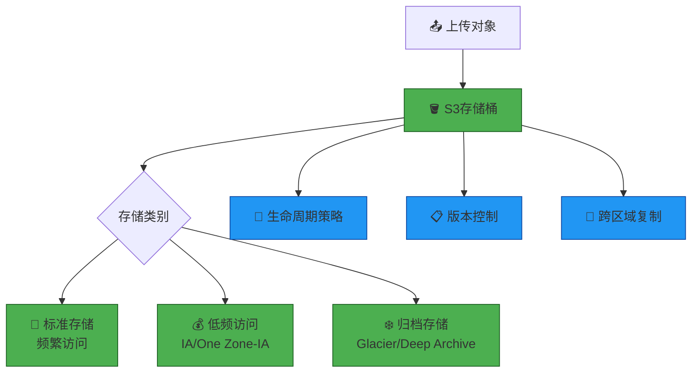

**核心知识**
- 存储类别和成本优化
- 生命周期策略
- 版本控制和 MFA 删除
- 跨区域复制（CRR）
- 静态网站托管
- 预签名 URL
- S3 事件通知

**实践任务**
- 创建和配置 S3 存储桶
- 实现生命周期自动归档
- 配置跨区域复制
- 托管静态网站

#### EBS (Elastic Block Store)
- 卷类型选择（gp3、io2、st1、sc1）
- 快照和备份
- 加密配置
- 性能优化

#### EFS (Elastic File System)
- NFS 共享文件系统
- 性能模式
- 生命周期管理

#### 📚 推荐资源
- 📚 [Amazon S3 用户指南（中文）](https://docs.aws.amazon.com/zh_cn/s3/) - S3 官方完整文档
- 📖 [Amazon EBS 用户指南（中文）](https://docs.aws.amazon.com/zh_cn/ebs/) - 块存储服务
- 📖 [Amazon EFS 用户指南（中文）](https://docs.aws.amazon.com/zh_cn/efs/) - 文件系统服务

### 3️⃣ 网络服务

#### VPC (Virtual Private Cloud)
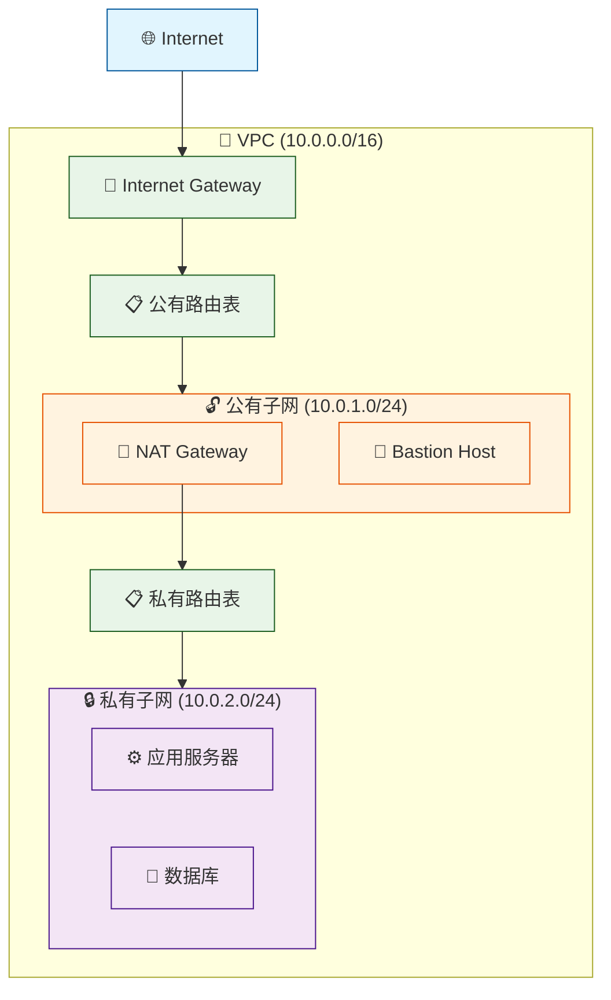

**核心知识**
- VPC 设计和 CIDR 规划
- 子网划分（公有/私有）
- 路由表配置
- Internet Gateway vs NAT Gateway
- VPC Peering
- Transit Gateway
- VPN 和 Direct Connect
- 安全组 vs 网络 ACL

**实践任务**
- 设计多层 VPC 架构
- 配置公有和私有子网
- 实现 NAT 网关
- 建立 VPC Peering 连接

#### Route 53 (DNS 服务)
- 域名注册和托管
- 路由策略（简单、加权、延迟、故障转移）
- 健康检查
- 流量管理

#### CloudFront (CDN)
- 分发配置
- 缓存策略
- 源站保护
- SSL/TLS 证书

#### 📚 推荐资源
- 📚 [Amazon VPC 用户指南（中文）](https://docs.aws.amazon.com/zh_cn/vpc/) - VPC 官方完整文档
- 📖 [Amazon Route 53 开发者指南（中文）](https://docs.aws.amazon.com/zh_cn/route53/) - DNS 服务
- 📖 [Amazon CloudFront 开发者指南（中文）](https://docs.aws.amazon.com/zh_cn/cloudfront/) - CDN 服务
---

### 4️⃣ 数据库服务

#### RDS (关系型数据库)
- 引擎选择（MySQL、PostgreSQL、Oracle、SQL Server）
- 多可用区部署
- 只读副本
- 自动备份和快照
- 参数组和选项组
- 性能洞察

#### Aurora
- MySQL/PostgreSQL 兼容
- 全球数据库
- 无服务器 v2
- 性能优势

#### DynamoDB (NoSQL)
- 表设计和分区键
- 读写容量模式
- 全局二级索引
- DynamoDB Streams
- 备份和恢复

#### 📚 推荐资源
- 📚 [Amazon RDS 用户指南（中文）](https://docs.aws.amazon.com/zh_cn/rds/) - RDS 官方完整文档

---

### 5️⃣ 监控和管理

#### CloudWatch
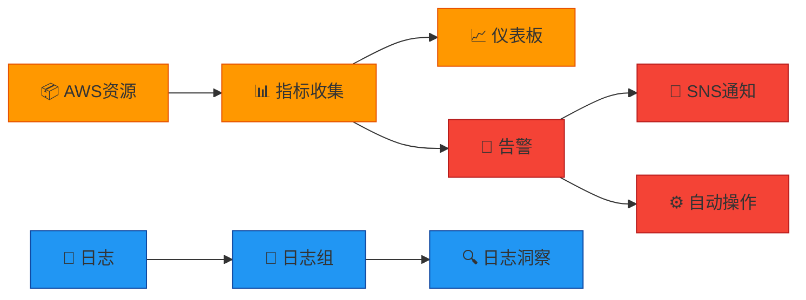

**核心功能**
- 指标监控和自定义指标
- 日志收集和分析
- 告警配置
- 仪表板创建
- EventBridge 事件驱动

#### CloudTrail
- API 调用审计
- 合规性监控
- 安全分析

#### Systems Manager
- 参数存储
- Session Manager
- Patch Manager
- Run Command

#### 📚 推荐资源
- 📚 [Amazon CloudWatch 用户指南（中文）](https://docs.aws.amazon.com/zh_cn/cloudwatch/) - 监控服务完整文档
- 📖 [AWS CloudTrail 用户指南（中文）](https://docs.aws.amazon.com/zh_cn/cloudtrail/) - 审计和合规
- 📖 [AWS Systems Manager 用户指南（中文）](https://docs.aws.amazon.com/zh_cn/systems-manager/) - 运维管理工具
---

### 6️⃣ 云部署（Cloud Deployment）

#### 🎯 学习目标
- 掌握基础设施即代码（IaC）
- 实现自动化部署流程
- 理解 CI/CD 最佳实践

#### 📖 核心技术

**CloudFormation**
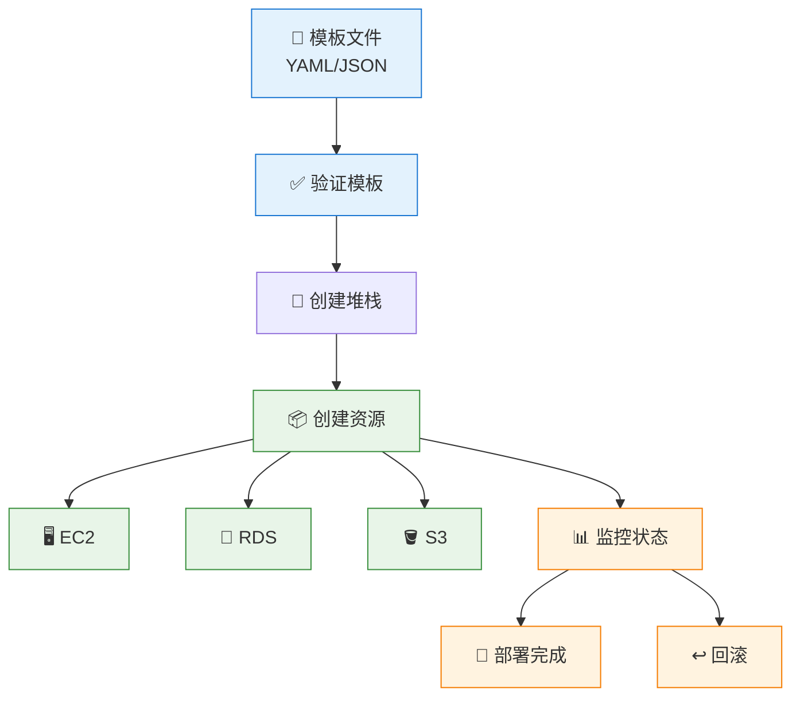

**知识点**
- 模板语法和结构
- 参数和映射
- 条件和输出
- 嵌套堆栈
- StackSets 多账户部署
- 变更集预览
- 漂移检测

**Terraform**
- HCL 语法
- Provider 配置
- 模块化设计
- 状态管理
- Terraform Cloud

**CI/CD 流程(选修)** 
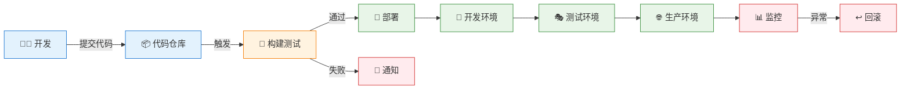

**工具链**
- CodeCommit：代码仓库
- CodeBuild：构建服务
- CodeDeploy：部署服务
- CodePipeline：持续交付
- Jenkins/GitLab CI 集成

#### 🔧 实践项目
1. 使用 CloudFormation 部署三层架构
2. 使用 Terraform 部署相同架构（对比体验）
3. 实现蓝绿部署策略
4. 配置 CI/CD 流水线
5. 多环境管理（开发/测试/生产）

#### 📚 推荐资源

**CloudFormation**
- 📚 [AWS CloudFormation 用户指南（中文）](https://docs.aws.amazon.com/zh_cn/cloudformation/)
- 📖 [CloudFormation 最佳实践](https://docs.aws.amazon.com/zh_cn/AWSCloudFormation/latest/UserGuide/best-practices.html)
- 🔗 [CloudFormation 模板示例](https://github.com/awslabs/aws-cloudformation-templates)

**Terraform**
- 🎓 [Terraform 中文教程](https://lonegunmanb.github.io/introduction-terraform/)
- 🔗 [Terraform AWS 模块](https://github.com/terraform-aws-modules)

**CI/CD（重点推荐）**
- 🌟 [《什么是 CI/CD Pipeline？》- OpsMx](https://www.opsmx.com/blog/what-is-a-ci-cd-pipeline/) - 全面介绍 CI/CD 流水线的概念、组成部分和最佳实践，包含详细的流程图和实际案例，适合初学者理解 CI/CD 的完整工作流程
- 📖 [AWS CodePipeline 用户指南（中文）](https://docs.aws.amazon.com/zh_cn/codepipeline/latest/userguide/) - AWS 原生 CI/CD 服务

---

## 🎓 阶段三：专业领域进阶

### 1️⃣ 云迁移（Cloud Migration）

#### 🎯 学习目标
- 掌握迁移评估方法
- 熟悉迁移工具和策略
- 实现零停机迁移

#### 📖 迁移策略（6R）

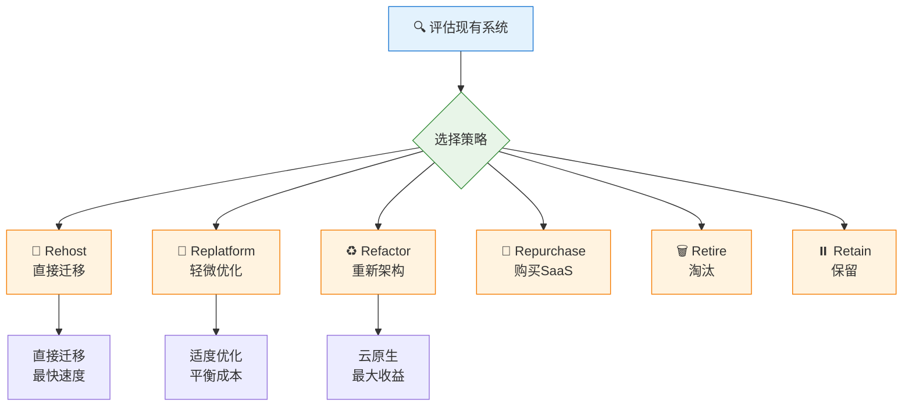

**迁移阶段**
1. **评估阶段**
   - 应用清单
   - 依赖关系分析
   - TCO 计算
   - Migration Evaluator

2. **准备阶段**
   - 账户设置
   - Landing Zone 配置
   - 网络规划
   - 安全基线

3. **迁移阶段**
   - 试点迁移
   - 批量迁移
   - 数据同步
   - 切换验证

4. **优化阶段**
   - 性能调优
   - 成本优化
   - 安全加固
   - 运维自动化

#### 🛠️ 迁移工具

**服务器迁移**
- AWS Application Migration Service (MGN)
- Server Migration Service (SMS)
- VM Import/Export

**数据库迁移**
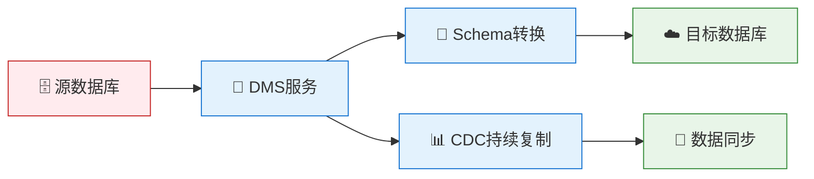

- Database Migration Service (DMS)
- Schema Conversion Tool (SCT)
- 同构迁移 vs 异构迁移
- CDC 持续数据复制

**数据传输**
- DataSync：在线数据传输
- Transfer Family：SFTP/FTPS
- Snow Family：离线数据传输
  - Snowcone：8TB
  - Snowball：80TB
  - Snowmobile：100PB

#### 📚 推荐资源
- 📚 [AWS 应用程序迁移服务文档（中文）](https://docs.aws.amazon.com/zh_cn/mgn/)
- 📚 [AWS 数据库迁移服务文档（中文）](https://docs.aws.amazon.com/zh_cn/dms/)
- 🎓 [AWS 迁移加速计划（MAP）](https://aws.amazon.com/cn/migration-acceleration-program/)

---

### 2️⃣ 云安全（Cloud Security）

#### 🎯 学习目标
- 理解 AWS 责任共担模型
- 掌握身份和访问管理
- 实现纵深防御策略

#### 📖 安全框架

**责任共担模型**
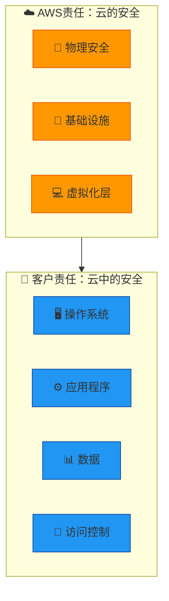

**IAM (身份和访问管理)**
- 用户、组、角色
- 策略类型（托管策略、内联策略）
- 最小权限原则
- MFA 多因素认证
- 跨账户访问
- IAM Access Analyzer
- 服务控制策略（SCP）

**网络安全**
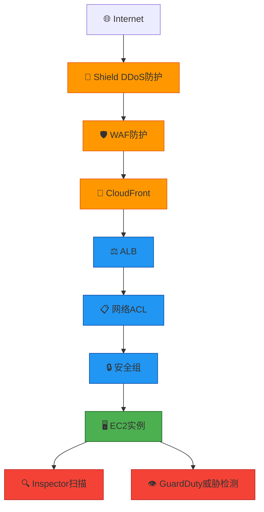

**安全服务**
- AWS WAF：Web 应用防火墙
- Shield：DDoS 防护
- GuardDuty：威胁检测
- Inspector：漏洞扫描
- Macie：数据隐私保护
- Security Hub：安全态势管理
- Detective：安全调查

**数据保护**
- KMS 密钥管理
- Secrets Manager 密钥存储
- Certificate Manager 证书管理
- S3 加密（SSE-S3、SSE-KMS、SSE-C）
- EBS 加密
- RDS 加密

**合规性**
- AWS Artifact
- Config 合规检查
- CloudTrail 审计日志
- 合规框架（PCI-DSS、HIPAA、SOC）

#### 📚 推荐资源
- 📚 [AWS 安全最佳实践（中文）](https://docs.aws.amazon.com/zh_cn/security/)
- 📚 [AWS IAM 用户指南（中文）](https://docs.aws.amazon.com/zh_cn/iam/)
- 🎓 [AWS 安全学习路径](https://aws.amazon.com/cn/training/learn-about/security/)
- 🎓 [阿里云安全白皮书](https://www.alibabacloud.com/zh/trust-center/security) - 参考学习
- 📺 [AWS 安全实战 - B站](https://www.bilibili.com/video/BV1aK4y1s7Qm/)
- 🔗 [AWS 安全博客（中文）](https://aws.amazon.com/cn/blogs/security/)

---

### 3️⃣ 云灾备（Disaster Recovery）

#### 🎯 学习目标
- 理解 RTO 和 RPO 概念
- 掌握灾备策略选择
- 实现自动化故障转移

#### 📖 灾备策略

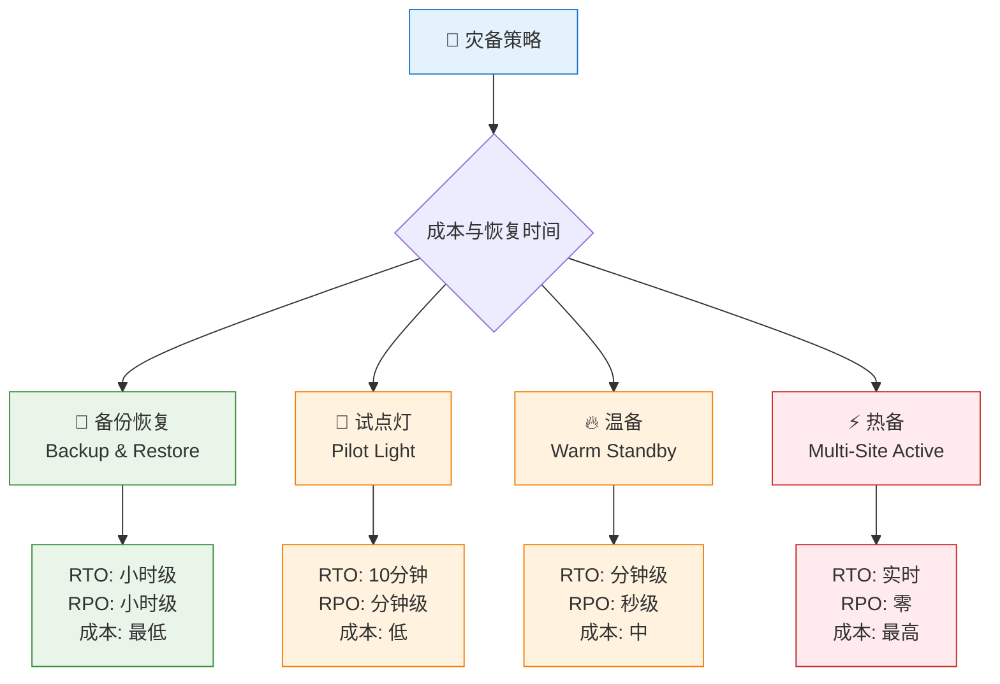

**关键指标**
- RTO (Recovery Time Objective)：恢复时间目标
- RPO (Recovery Point Objective)：恢复点目标
- MTTR (Mean Time To Recover)：平均恢复时间
- MTBF (Mean Time Between Failures)：平均故障间隔

**备份策略**
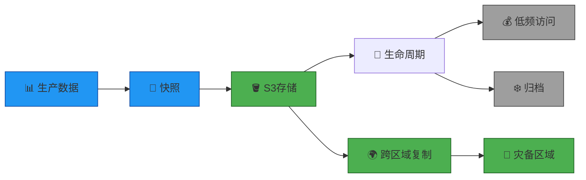

**备份工具**
- AWS Backup：集中式备份
- EBS 快照
- RDS 自动备份
- S3 版本控制
- DynamoDB 时间点恢复

**高可用架构**
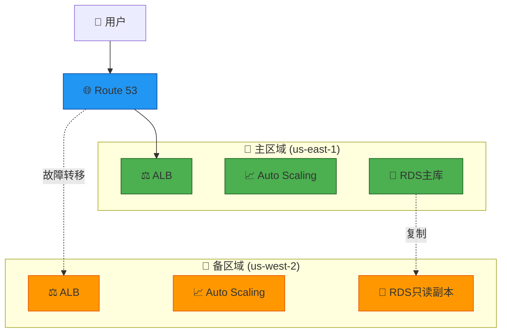

**故障转移**
- Route 53 健康检查
- 故障转移路由策略
- RDS 多可用区
- Aurora 全球数据库
- DynamoDB 全球表

**测试和演练**
- 定期灾备演练
- 故障注入测试
- 恢复流程文档
- 自动化恢复脚本

#### 📚 推荐资源
- 📚 [AWS 灾难恢复白皮书（中文）](https://docs.aws.amazon.com/zh_cn/whitepapers/latest/disaster-recovery-workloads-on-aws/)
- 📚 [AWS Backup 用户指南（中文）](https://docs.aws.amazon.com/zh_cn/aws-backup/)
- 🎓 [AWS 灾备解决方案](https://aws.amazon.com/cn/disaster-recovery/)
- 🎓 [AWS 弹性架构设计](https://aws.amazon.com/cn/architecture/well-architected/)
- 📺 [AWS 高可用架构设计 - B站](https://www.bilibili.com/video/BV1NK4y1s7Qp/)
- 🔗 [AWS 架构中心 - 灾备方案](https://aws.amazon.com/cn/architecture/)

---

## 🏆 阶段四：高级实践

### 1️⃣ 架构设计

#### Well-Architected Framework
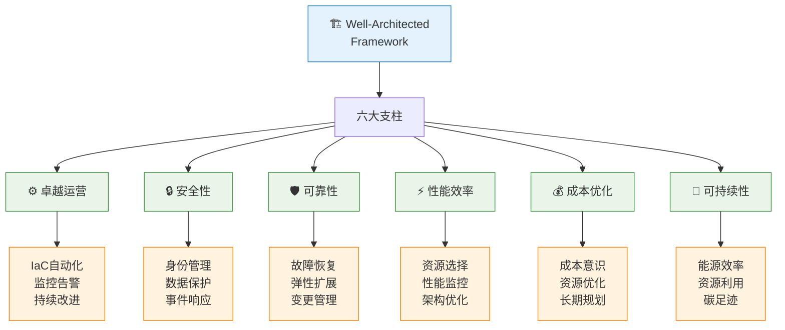

**设计原则**
- 可扩展性设计
- 松耦合架构
- 无状态应用
- 异步处理
- 缓存策略
- 数据库分片

**架构模式**
- 微服务架构
- 事件驱动架构
- Serverless 架构
- 混合云架构
- 多区域架构

#### 🔧 实践项目
1. 设计电商平台架构
2. 实现微服务拆分
3. 构建事件驱动系统
4. 进行架构评审

---

### 2️⃣ 成本优化

#### 成本管理策略
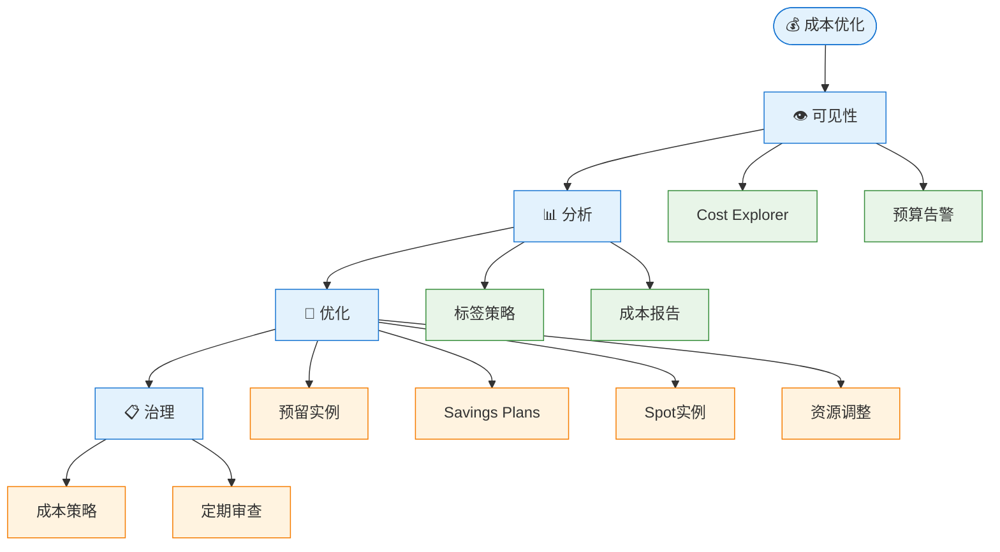

**成本优化工具**
- Cost Explorer：成本分析
- Budgets：预算管理
- Cost Anomaly Detection：异常检测
- Compute Optimizer：资源推荐
- Trusted Advisor：最佳实践检查

**优化策略**
- 预留实例（RI）
- Savings Plans
- Spot 实例
- 资源右调整
- 自动关闭非生产环境
- S3 智能分层
- 数据传输优化

#### 🔧 实践项目
1. 分析月度成本报告
2. 实施标签策略
3. 购买预留实例
4. 优化存储成本

---

### 3️⃣ 自动化运维

#### DevOps 实践
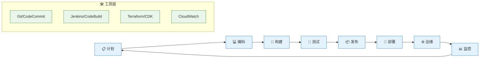

**自动化领域**
- 基础设施自动化（IaC）
- 配置管理（Ansible、Chef、Puppet）
- 部署自动化（CodeDeploy）
- 监控自动化（CloudWatch、Datadog）
- 安全自动化（Security Hub）
- 成本自动化（Lambda + Cost Explorer）

**运维工具**
- Systems Manager
  - Session Manager：安全连接
  - Patch Manager：补丁管理
  - Automation：运维自动化
  - Parameter Store：参数管理
- OpsWorks：配置管理
- Service Catalog：服务目录
- Control Tower：多账户治理

**监控和告警**
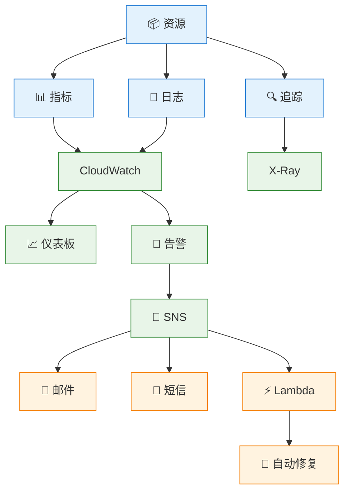

#### 🔧 实践项目
1. 构建完整 CI/CD 流水线
2. 实现基础设施即代码
3. 配置自动化运维
4. 建立监控告警体系

---

### 4️⃣ 容器和 Kubernetes

#### 容器技术栈
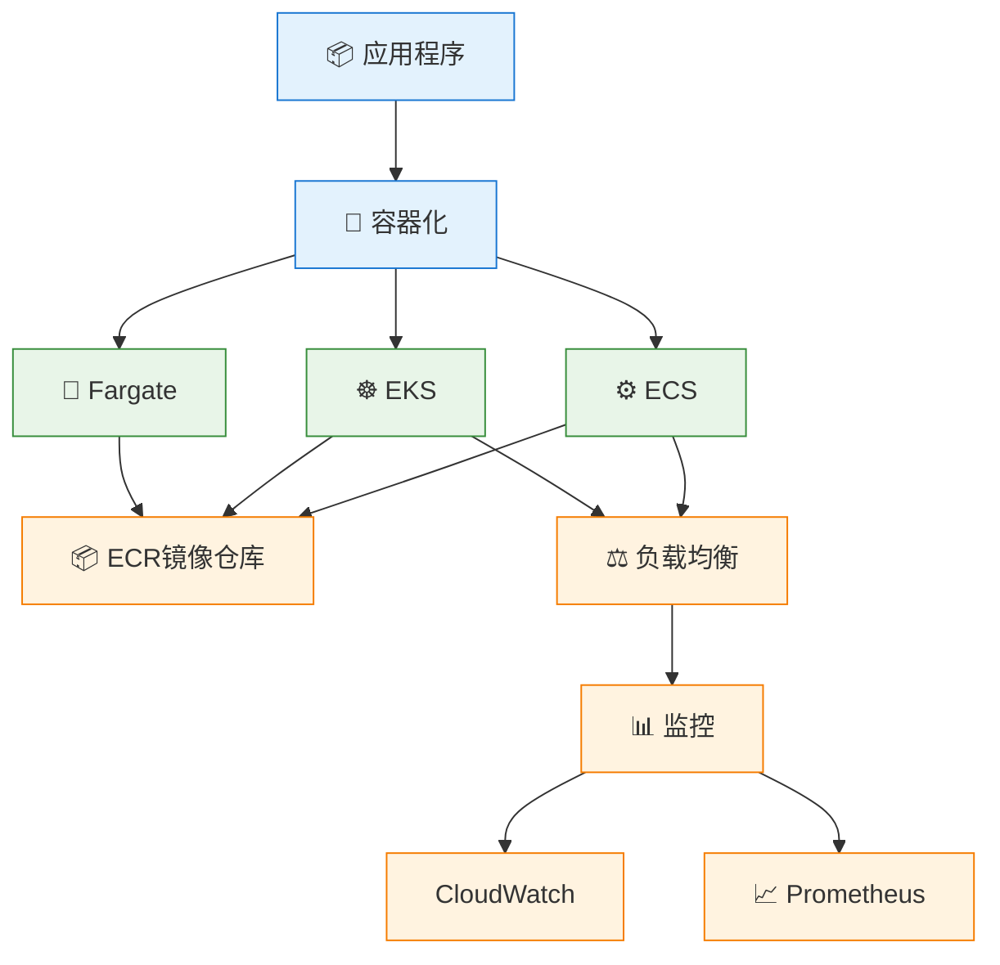

**ECS 核心概念**
- 任务定义（Task Definition）
- 服务（Service）
- 集群（Cluster）
- 启动类型（EC2 vs Fargate）
- 服务发现
- 负载均衡集成

**EKS 核心概念**
- Kubernetes 基础
- Pod、Deployment、Service
- ConfigMap 和 Secret
- Ingress 控制器
- Helm 包管理
- 集群自动扩展

**最佳实践**
- 镜像优化和安全扫描
- 多阶段构建
- 资源限制和请求
- 健康检查配置
- 日志和监控
- 蓝绿部署和金丝雀发布

#### 🔧 实践项目
1. 容器化现有应用
2. 部署 ECS 服务
3. 搭建 EKS 集群
4. 实现服务网格（Istio/App Mesh）

---

### 5️⃣ 大数据和分析

#### 数据处理流程
```mermaid
flowchart LR
    Source[📊 数据源] --> Ingest[📥 采集]
    Ingest --> Store[💾 存储]
    Store --> Process[⚙️ 处理]
    Process --> Analyze[🔍 分析]
    Analyze --> Visualize[📈 可视化]
    
    Ingest --> Kinesis[Kinesis]
    Store --> S3[S3]
    Store --> Lake[Lake Formation]
    Process --> EMR[EMR]
    Process --> Glue[Glue]
    Analyze --> Athena[Athena]
    Analyze --> Redshift[Redshift]
    Visualize --> QuickSight[QuickSight]
    
    classDef stage fill:#e3f2fd,stroke:#1976d2
    classDef service fill:#e8f5e8,stroke:#388e3c
    
    class Source,Ingest,Store,Process,Analyze,Visualize stage
    class Kinesis,S3,Lake,EMR,Glue,Athena,Redshift,QuickSight service
```

**核心服务**
- Kinesis：实时数据流
- EMR：大数据处理（Hadoop、Spark）
- Glue：ETL 服务
- Athena：无服务器查询
- Redshift：数据仓库
- QuickSight：商业智能
- Lake Formation：数据湖

#### 🔧 实践项目
1. 构建实时数据管道
2. 搭建数据湖
3. 实现 ETL 流程
4. 创建数据分析仪表板

---

### 6️⃣ 机器学习

#### ML 工作流
```mermaid
flowchart TD
    Data[📊 数据准备] --> Train[🎓 模型训练]
    Train --> Evaluate[📈 模型评估]
    Evaluate --> Deploy[🚀 模型部署]
    Deploy --> Monitor[📊 监控]
    Monitor --> Retrain[🔄 重新训练]
    Retrain --> Train
    
    Data --> S3[S3存储]
    Train --> SageMaker[SageMaker]
    Deploy --> Endpoint[推理端点]
    Monitor --> CloudWatch[CloudWatch]
    
    classDef stage fill:#e3f2fd,stroke:#1976d2
    classDef service fill:#e8f5e8,stroke:#388e3c
    
    class Data,Train,Evaluate,Deploy,Monitor,Retrain stage
    class S3,SageMaker,Endpoint,CloudWatch service
```

**SageMaker 功能**
- Studio：集成开发环境
- Notebooks：Jupyter 笔记本
- Training：模型训练
- Inference：模型推理
- Pipelines：ML 流水线
- Feature Store：特征存储

**AI 服务**
- Rekognition：图像识别
- Comprehend：自然语言处理
- Polly：文本转语音
- Transcribe：语音转文本
- Translate：机器翻译
- Lex：对话机器人

#### 🔧 实践项目
1. 训练图像分类模型
2. 部署推理端点
3. 构建聊天机器人
4. 实现文本分析

---

## 🔨 实战项目

### 项目一：三层 Web 应用部署

#### 🎯 项目目标
部署一个高可用的三层 Web 应用架构

#### 🏗️ 架构图
```mermaid
graph TB
    User[👤 用户] --> R53[🌐 Route 53]
    R53 --> CloudFront[📡 CloudFront CDN]
    CloudFront --> WAF[🛡️ WAF]
    
    WAF --> ALB[⚖️ Application Load Balancer]
    
    subgraph VPC["🏢 VPC (10.0.0.0/16)"]
        subgraph AZ1["📍 可用区 1"]
            Web1[🌐 Web服务器<br/>Nginx]
            App1[⚙️ 应用服务器<br/>Node.js]
            DB1[💾 RDS主库<br/>MySQL]
        end
        
        subgraph AZ2["📍 可用区 2"]
            Web2[🌐 Web服务器<br/>Nginx]
            App2[⚙️ 应用服务器<br/>Node.js]
            DB2[💾 RDS备库<br/>MySQL]
        end
        
        ALB --> Web1
        ALB --> Web2
        Web1 --> App1
        Web2 --> App2
        App1 --> DB1
        App2 --> DB1
        DB1 -.复制.-> DB2
    end
    
    App1 --> S3[🪣 S3存储<br/>静态资源]
    App2 --> S3
    
    classDef user fill:#e3f2fd,stroke:#1976d2
    classDef edge fill:#ff9800,stroke:#e65100
    classDef web fill:#4caf50,stroke:#1b5e20
    classDef app fill:#2196f3,stroke:#0d47a1
    classDef db fill:#9c27b0,stroke:#4a148c
    classDef storage fill:#00bcd4,stroke:#006064
    
    class User,R53 user
    class CloudFront,WAF,ALB edge
    class Web1,Web2 web
    class App1,App2 app
    class DB1,DB2 db
    class S3 storage
```

#### 📋 实施步骤
1. **网络层**
   - 创建 VPC 和子网
   - 配置路由表和网关
   - 设置安全组和 NACL

2. **数据层**
   - 部署 RDS MySQL 多可用区
   - 配置参数组
   - 设置自动备份

3. **应用层**
   - 启动 EC2 实例
   - 安装应用程序
   - 配置 Auto Scaling

4. **展示层**
   - 配置 ALB
   - 设置健康检查
   - 配置 CloudFront

5. **监控和告警**
   - 配置 CloudWatch 监控
   - 设置告警规则
   - 创建仪表板

#### 🎓 学习要点
- VPC 网络设计
- 高可用架构
- 负载均衡配置
- 数据库管理
- 监控和告警

---

### 项目二：Serverless 应用

#### 🎯 项目目标
构建一个无服务器的 REST API 应用

#### 🏗️ 架构图
```mermaid
graph LR
    User[👤 用户] --> API[🌐 API Gateway]
    
    API --> Auth[🔐 Cognito<br/>用户认证]
    API --> Lambda1[⚡ Lambda<br/>创建]
    API --> Lambda2[⚡ Lambda<br/>读取]
    API --> Lambda3[⚡ Lambda<br/>更新]
    API --> Lambda4[⚡ Lambda<br/>删除]
    
    Lambda1 --> DDB[💾 DynamoDB]
    Lambda2 --> DDB
    Lambda3 --> DDB
    Lambda4 --> DDB
    
    Lambda1 --> S3[🪣 S3<br/>文件存储]
    
    DDB --> Stream[📊 DynamoDB<br/>Streams]
    Stream --> Lambda5[⚡ Lambda<br/>数据处理]
    Lambda5 --> SQS[📬 SQS队列]
    
    classDef user fill:#e3f2fd,stroke:#1976d2
    classDef api fill:#4caf50,stroke:#1b5e20
    classDef compute fill:#ff9800,stroke:#e65100
    classDef storage fill:#2196f3,stroke:#0d47a1
    
    class User user
    class API,Auth api
    class Lambda1,Lambda2,Lambda3,Lambda4,Lambda5 compute
    class DDB,S3,Stream,SQS storage
```

#### 📋 实施步骤
1. **API 层**
   - 创建 API Gateway
   - 配置资源和方法
   - 设置 CORS

2. **认证层**
   - 配置 Cognito 用户池
   - 设置授权器
   - 实现 JWT 验证

3. **计算层**
   - 编写 Lambda 函数
   - 配置环境变量
   - 设置 IAM 角色

4. **数据层**
   - 创建 DynamoDB 表
   - 设计分区键和排序键
   - 配置 Streams

5. **部署和测试**
   - 使用 SAM/CDK 部署
   - API 测试
   - 性能优化

#### 🎓 学习要点
- Serverless 架构
- API Gateway 配置
- Lambda 函数开发
- DynamoDB 设计
- 事件驱动架构

---

### 项目三：容器化微服务

#### 🎯 项目目标
使用 ECS/EKS 部署微服务应用

#### 🏗️ 架构图
```mermaid
graph TB
    User[👤 用户] --> ALB[⚖️ ALB]
    
    subgraph EKS["☸️ EKS集群"]
        subgraph NS1["📦 命名空间: frontend"]
            Web[🌐 Web服务<br/>React]
        end
        
        subgraph NS2["📦 命名空间: backend"]
            API[⚙️ API服务<br/>Node.js]
            Auth[🔐 认证服务<br/>Go]
            Order[🛒 订单服务<br/>Python]
        end
        
        Ingress[🚪 Ingress<br/>Controller]
    end
    
    ALB --> Ingress
    Ingress --> Web
    Web --> API
    API --> Auth
    API --> Order
    
    Order --> RDS[💾 RDS<br/>PostgreSQL]
    Order --> Redis[🔴 ElastiCache<br/>Redis]
    
    API --> SQS[📬 SQS]
    SQS --> Worker[⚙️ Worker服务]
    
    classDef user fill:#e3f2fd,stroke:#1976d2
    classDef frontend fill:#4caf50,stroke:#1b5e20
    classDef backend fill:#ff9800,stroke:#e65100
    classDef data fill:#2196f3,stroke:#0d47a1
    
    class User,ALB user
    class Web,Ingress frontend
    class API,Auth,Order,Worker backend
    class RDS,Redis,SQS data
```

#### 📋 实施步骤
1. **容器化**
   - 编写 Dockerfile
   - 构建镜像
   - 推送到 ECR

2. **集群搭建**
   - 创建 EKS 集群
   - 配置节点组
   - 安装 kubectl

3. **服务部署**
   - 编写 Kubernetes 清单
   - 部署 Deployment
   - 配置 Service

4. **网络配置**
   - 安装 Ingress Controller
   - 配置路由规则
   - 设置 SSL 证书

5. **监控和日志**
   - 部署 Prometheus
   - 配置 Grafana
   - 集成 CloudWatch

#### 🎓 学习要点
- Docker 容器化
- Kubernetes 基础
- 微服务架构
- 服务网格
- 容器监控

---

### 项目四：数据湖和分析平台

#### 🎯 项目目标
构建企业级数据湖和分析平台

#### 🏗️ 架构图
```mermaid
flowchart TB
    subgraph Sources["📊 数据源"]
        DB[💾 数据库]
        Logs[📝 日志]
        API[🌐 API]
        Files[📁 文件]
    end
    
    subgraph Ingestion["📥 数据采集"]
        Kinesis[🌊 Kinesis<br/>Data Streams]
        DMS[🔄 DMS]
        DataSync[📤 DataSync]
    end
    
    subgraph Storage["💾 数据存储"]
        S3_Raw[🪣 S3 Raw<br/>原始数据]
        S3_Processed[🪣 S3 Processed<br/>处理后数据]
        S3_Curated[🪣 S3 Curated<br/>精选数据]
    end
    
    subgraph Processing["⚙️ 数据处理"]
        Glue[🔧 Glue ETL]
        EMR[📊 EMR<br/>Spark]
        Lambda[⚡ Lambda]
    end
    
    subgraph Analytics["🔍 数据分析"]
        Athena[🔎 Athena<br/>查询]
        Redshift[📊 Redshift<br/>数仓]
        QuickSight[📈 QuickSight<br/>BI]
    end
    
    Sources --> Ingestion
    Ingestion --> S3_Raw
    S3_Raw --> Processing
    Processing --> S3_Processed
    S3_Processed --> Processing
    Processing --> S3_Curated
    S3_Curated --> Analytics
    
    classDef source fill:#e3f2fd,stroke:#1976d2
    classDef ingest fill:#fff3e0,stroke:#f57c00
    classDef storage fill:#e8f5e8,stroke:#388e3c
    classDef process fill:#f3e5f5,stroke:#7b1fa2
    classDef analytics fill:#ffebee,stroke:#c62828
    
    class DB,Logs,API,Files source
    class Kinesis,DMS,DataSync ingest
    class S3_Raw,S3_Processed,S3_Curated storage
    class Glue,EMR,Lambda process
    class Athena,Redshift,QuickSight analytics
```

#### 📋 实施步骤
1. **数据采集**
   - 配置 Kinesis Data Streams
   - 设置 DMS 复制任务
   - 实现实时数据流

2. **数据存储**
   - 设计 S3 分层存储
   - 配置生命周期策略
   - 实现数据分区

3. **数据处理**
   - 编写 Glue ETL 作业
   - 配置 Glue Crawler
   - 运行 EMR 集群

4. **数据分析**
   - 创建 Athena 查询
   - 搭建 Redshift 集群
   - 设计 QuickSight 仪表板

5. **治理和安全**
   - 配置 Lake Formation
   - 设置数据权限
   - 实现数据质量检查

#### 🎓 学习要点
- 数据湖架构
- ETL 流程设计
- 大数据处理
- 数据治理
- BI 可视化

---

### 项目五：灾备和高可用

#### 🎯 项目目标
实现跨区域灾备和自动故障转移

#### 🏗️ 架构图
```mermaid
graph TB
    User[👤 用户] --> R53[🌐 Route 53<br/>故障转移路由]
    
    subgraph Primary["🏢 主区域 (us-east-1)"]
        ALB1[⚖️ ALB]
        ASG1[📈 Auto Scaling]
        RDS1[💾 RDS主库]
        S3_1[🪣 S3]
    end
    
    subgraph Secondary["🏢 备区域 (us-west-2)"]
        ALB2[⚖️ ALB]
        ASG2[📈 Auto Scaling]
        RDS2[💾 RDS只读副本]
        S3_2[🪣 S3]
    end
    
    R53 --> ALB1
    R53 -.故障转移.-> ALB2
    
    RDS1 -.跨区域复制.-> RDS2
    S3_1 -.CRR复制.-> S3_2
    
    Health[❤️ 健康检查] --> R53
    Health --> ALB1
    Health -.监控.-> ALB2
    
    Backup[💾 AWS Backup] --> RDS1
    Backup --> S3_1
    
    classDef primary fill:#4caf50,stroke:#1b5e20
    classDef secondary fill:#ff9800,stroke:#e65100
    classDef dns fill:#2196f3,stroke:#0d47a1
    classDef monitor fill:#9c27b0,stroke:#4a148c
    
    class ALB1,ASG1,RDS1,S3_1 primary
    class ALB2,ASG2,RDS2,S3_2 secondary
    class R53,User dns
    class Health,Backup monitor
```

#### 📋 实施步骤
1. **主区域部署**
   - 部署完整应用栈
   - 配置监控告警
   - 设置自动备份

2. **备区域准备**
   - 复制基础设施
   - 配置数据复制
   - 准备故障转移脚本

3. **数据同步**
   - 配置 RDS 跨区域复制
   - 设置 S3 CRR
   - 验证数据一致性

4. **故障转移配置**
   - 配置 Route 53 健康检查
   - 设置故障转移路由
   - 编写自动化脚本

5. **演练和测试**
   - 进行故障转移演练
   - 测试 RTO/RPO
   - 优化恢复流程

#### 🎓 学习要点
- 灾备策略设计
- 跨区域复制
- 自动故障转移
- 备份和恢复
- 演练和测试

---

## 📚 学习资源

### 官方资源

#### AWS 官方文档
- [AWS 文档中心](https://docs.aws.amazon.com/) - 所有服务的官方文档
- [AWS 架构中心](https://aws.amazon.com/architecture/) - 参考架构和最佳实践
- [AWS 白皮书](https://aws.amazon.com/whitepapers/) - 技术白皮书和指南
- [AWS Well-Architected Framework](https://aws.amazon.com/architecture/well-architected/) - 架构设计框架
- [AWS 中国区文档](https://docs.amazonaws.cn/) - 中国区域专用文档

#### AWS Training
- [AWS Skill Builder](https://skillbuilder.aws/) - 免费在线学习平台（500+ 免费课程），AWS 官方推出，包含互动式学习、实验室练习和技能评估，支持中文界面
- [AWS Training and Certification](https://aws.amazon.com/training/) - 官方培训和认证体系入口，提供讲师指导的课堂培训、在线培训和认证考试信息
- [AWS Workshops](https://workshops.aws/) - 实战工作坊，由 AWS 专家设计的实战项目集合，提供完整的动手实验环境和详细步骤
- [AWS Hands-on Tutorials](https://aws.amazon.com/getting-started/hands-on/) - 动手实验教程，面向初学者的分步指导，每个教程约 10-30 分钟，大部分在免费套餐范围内可完成
- [AWS Builder Labs](https://aws.amazon.com/training/digital/aws-builder-labs/) - 实验室环境，提供真实的 AWS 环境进行实践，无需自己的 AWS 账户即可学习

---

### 社区资源

#### 技术博客
- 🔗 [AWS 官方博客](https://aws.amazon.com/blogs/)
- 🔗 [AWS 架构博客](https://aws.amazon.com/blogs/architecture/)
- 🔗 [AWS 安全博客](https://aws.amazon.com/blogs/security/)
- 🔗 [AWS 中国博客](https://aws.amazon.com/cn/blogs/china/)
- 🔗 [AWS News Blog](https://aws.amazon.com/blogs/aws/)
- 🔗 [AWS Compute Blog](https://aws.amazon.com/blogs/compute/)

#### 技术论坛
- 🔗 [AWS re:Post](https://repost.aws/) - AWS 官方问答社区
- 🔗 [Stack Overflow - AWS 标签](https://stackoverflow.com/questions/tagged/amazon-web-services)
- 🔗 [Reddit r/aws](https://www.reddit.com/r/aws/)
- 🔗 [AWS 开发者论坛](https://forums.aws.amazon.com/)
- 🔗 [ServerFault - AWS 问题](https://serverfault.com/questions/tagged/amazon-web-services)

#### 开源项目
- 🔗 [AWS Samples](https://github.com/aws-samples) - AWS 官方示例代码
- 🔗 [AWS Labs](https://github.com/awslabs) - AWS 实验室项目
- 🔗 [Awesome AWS](https://github.com/donnemartin/awesome-aws) - AWS 资源精选列表
- 🔗 [AWS CDK Examples](https://github.com/aws-samples/aws-cdk-examples)
- 🔗 [Terraform AWS Modules](https://github.com/terraform-aws-modules)

---

### YouTube 频道

- 🔗 [AWS Events](https://www.youtube.com/@AWSEventsChannel) - AWS 官方活动和技术讲座录像
- 🔗 [freeCodeCamp - AWS 课程](https://www.youtube.com/@freecodecamp/search?query=aws) - 多个免费 AWS 认证和实战课程
- 🔗 [TechWorld with Nana](https://www.youtube.com/@TechWorldwithNana) - DevOps 和云技术教程

---

**祝你学习顺利，早日成为优秀的 AWS 技术支持工程师！** 🚀
